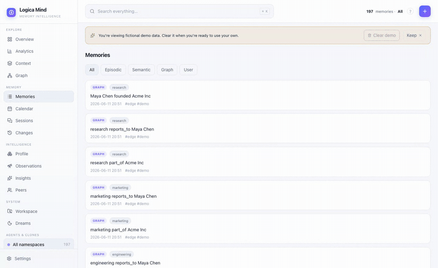
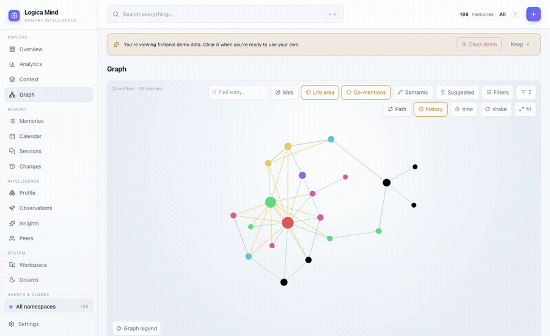
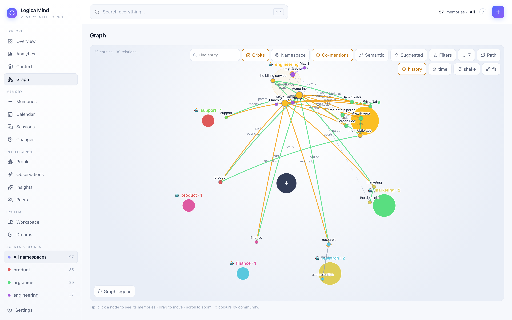
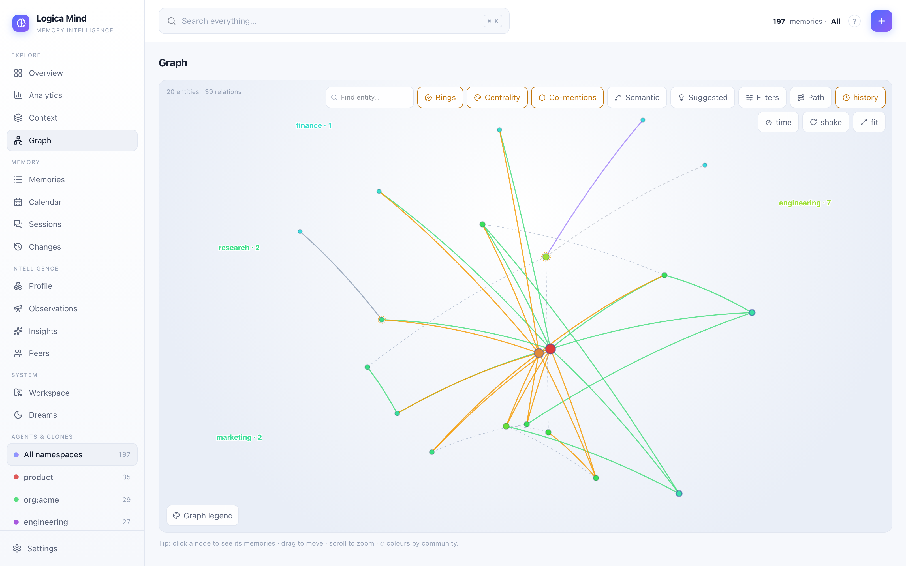
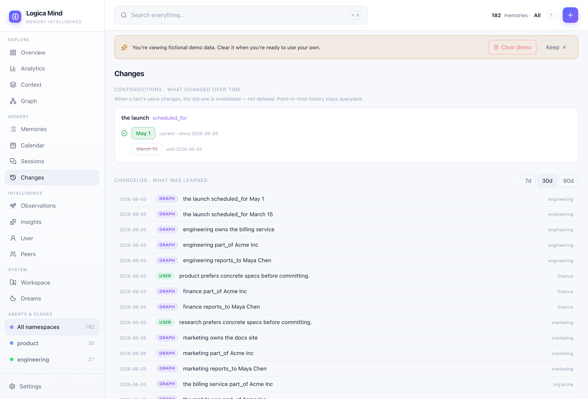
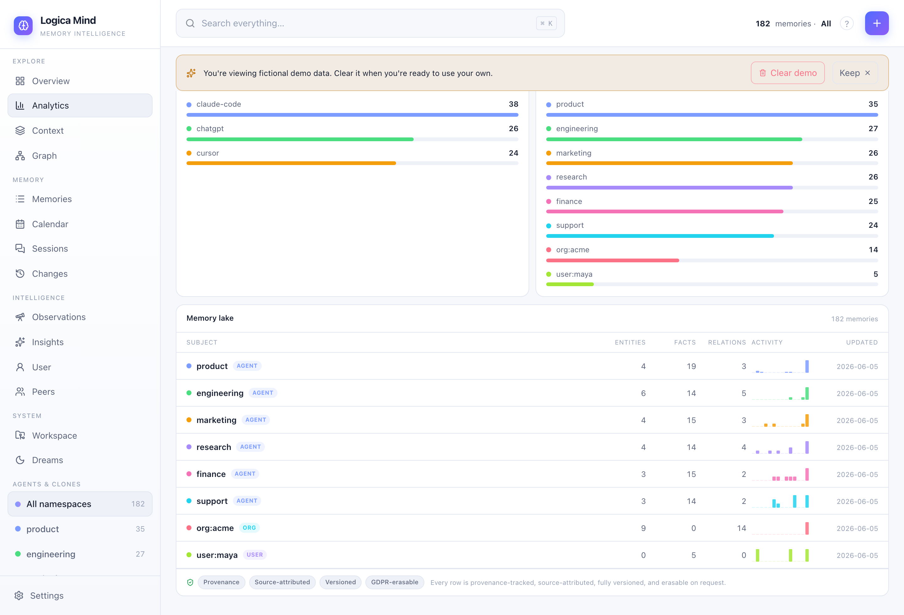
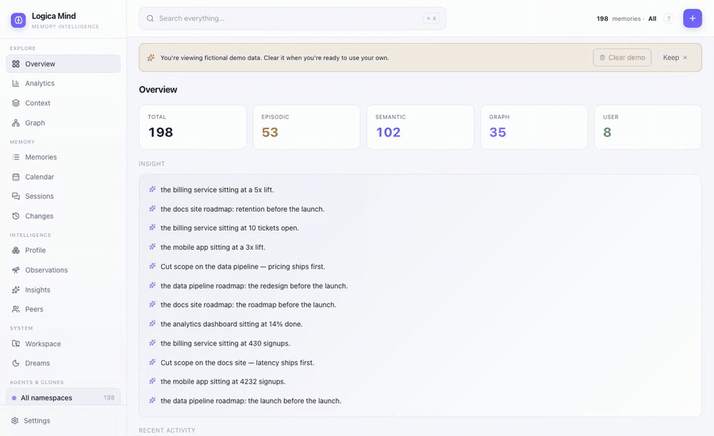
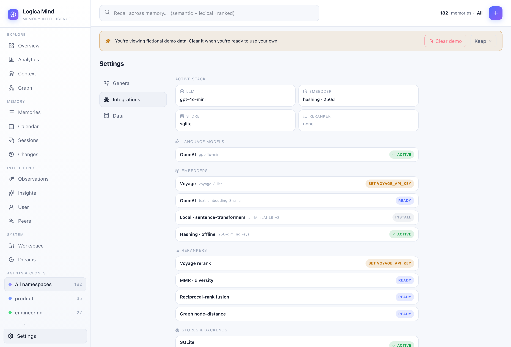
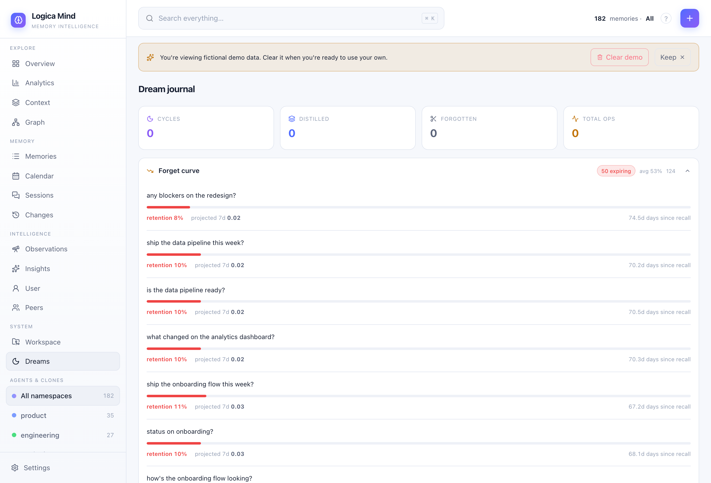

<div align="center">

# 🧠 Logica Mind

### Memory that thinks like a brain, not a database.

**Long-term memory for AI agents — episodic, semantic, a temporal knowledge graph & a dialectic user model in one library.**

[](LICENSE)
[](https://www.python.org/)
[](#%EF%B8%8F-building-from-source)
[](#-model-context-protocol-mcp)
[](CONTRIBUTING.md)

</div>

---

Most memory libraries for AI agents are a vector store with a friendlier API: you
write a fact, you search it back, and the moment a fact changes, the old one is
overwritten and gone. That's a flat database — it can tell you what your agent
believes *now*, but never what it believed last Tuesday when it made the call
that broke production.

**Logica Mind is built differently.** Four memory layers and a *temporal*
knowledge graph where every belief is stamped with when it became true and when
it stopped — so you can replay your agent's entire knowledge state at any past
instant, trace why any fact is believed, and watch a sleep-time cycle
consolidate, infer, and forget while the agent sits idle.

```python
mind.state_at("2026-01-01")     # replay everything the agent knew, at any past instant
mind.contradictions()            # every belief that changed value — and exactly when
```

It runs fully offline on the standard library — **zero dependencies, no API key
to start** — and is covered by **202 tests**, so you can verify every claim on
this page in five minutes. It then lights up Voyage, OpenAI, Supabase, Postgres
or Redis whenever you want them.

<div align="center">
  
  <br>
  <em>The built-in dashboard: edges hued by relation type, nodes sized by centrality, emergent co-mentions, a full filter bar, point-in-time replay — and intelligence (path-finding, bridges, suggested links) a hand-linked note graph can't have. Organize it as an organic <b>web</b>, as <b>facet orbits</b> (hubs with their members around them — by channel, agent, life-area or entity type) or as concentric <b>importance rings</b>; click a hub and only its participants stay lit.</em>
</div>

---

## ⚡ Install

```bash
pip install logica-mind                 # core: zero dependencies, fully offline
pip install "logica-mind[onnx]"         # + TRUE semantic recall without torch (~50MB; +22% recall@5 — see bench/)
pip install "logica-mind[voyage]"       # + Voyage embeddings & reranker
pip install "logica-mind[sqlcipher]"    # + at-rest encryption for the SQLite store
pip install "logica-mind[all]"          # + Voyage, OpenAI, Supabase, Postgres, Redis, local
```

## 🚀 30-second quickstart

```python
from logica_mind import LogicaMind

mind = LogicaMind(namespace="my-app")          # SQLite + offline embedder, no keys

# remember durable facts — extraction, dedup and conflict-resolution are automatic
mind.remember("The user prefers dark mode and concise answers.")
mind.remember("The user is based in Lisbon and works in fintech.")

# recall the most relevant memories (hybrid: semantic vector + lexical, ranked)
for hit in mind.recall("what does the user like?"):
    print(f"{hit.score:.2f}  {hit.memory.content}")

# see it live — open the dashboard
mind.serve()                                    # -> http://127.0.0.1:8420
```

> Prefer the terminal? `logica-mind demo` loads a fictional dataset so you can
> explore every feature instantly, and `logica-mind demo --clear` removes it.

---

## ⭐ What no other memory library does

This is the heart of Logica Mind. Everything below is **shipped and tested**.

### 🕰️ It's a time machine, not a log

Memory isn't just *what* you know — it's *when it became true and when it changed.*

```python
mind.graph.edges(at="2026-01-01")     # replay the ENTIRE knowledge state at a past instant
mind.state_at("2026-01-01")           # "what did the agent know when it made that decision?"
mind.contradictions()                  # every belief that changed value — and exactly when
mind.diff(since, until)                # a memory changelog: "what did this agent learn this week?"
```

- **Point-in-time replay** — reconstruct the full graph (or the whole mind) at any past date. Audit and debug agent behavior after the fact.
- **Temporal contradictions** — a new fact *closes* the old one instead of deleting it; the timeline stays queryable.
- **Memory changelog** — a first-class diff over what was learned in any window. Flat vector stores can't give you this.

### 🧬 A memory that behaves like a brain

```python
mind.forget_curve(days_halflife=30)    # Ebbinghaus decay: unused beliefs fade, recall reinforces
mind.dream(infer_links=True)           # sleep-time cycle: consolidate, reinforce, forget, INFER
mind.stale_beliefs()                   # epistemic self-doubt: "I'm not sure about this anymore"
```

- **Ebbinghaus forgetting curve** — beliefs decay exponentially if never recalled; recalling one resets its clock. The only memory layer where knowledge actually *ages*.
- **Inductive dreaming** — beyond consolidate/prune, the dream cycle **generates new inferred facts** (A→B, B→C ⟹ A relates to C) while idle. It doesn't just store; it reasons.
- **Epistemic self-doubt** — surfaces old, never-recalled, low-confidence beliefs the agent should re-verify. No other memory system exposes its own uncertainty.
- **Contested beliefs & surprise score** — when a new high-confidence belief overturns an old one, both are surfaced as *contested* and scored by how much the worldview shifted.
- **Dream journal** — every consolidation cycle is recorded (distilled / reinforced / forgotten / inferred) so you can *watch the memory think over time*.

### 🗂️ It learns what each fact *is*

Hand it raw text and it doesn't just store — it **decomposes** the message into
atomic facts and tags each with a **category** (an open label it coins) and a
**dimension** from a 34-dimension taxonomy across four groups: **Personal**
(mapped to Maslow's hierarchy), **Projects**, **Organization**, and
**Business & Finance**.

```python
mind.remember("I'm a Scorpio who loves flat whites; we hit $45k MRR and the launch is blocked on a payments bug.")
# → Identity·"Zodiac sign", Preference·"Coffee preference",
#   Business·"MRR", Project·"Launch blocker"  — four facts, four dimensions
mind.dimensions()   # the whole profile, grouped by dimension + Maslow tier
```

<div align="center">
  
  <br>
  <em>Live: hand it a messy sentence and watch it extract the fact, check it against what it already believes, and index it — no save button for each fact, no schema.</em>
</div>

<div align="center">
  
  <br>
  <em>The Profile view: a person <b>and</b> their work, organized — personal facts up Maslow's pyramid, plus Projects, Organization, and Business & Finance. The same animation shows it learning each categorized fact live.</em>
</div>

- **Person *and* work** — the taxonomy models a human (identity, health, spirituality, ambitions) and the work (project blockers, OKRs, MRR, runway) in one place.
- **Everywhere** — category + dimension ride on every memory: the Profile view (cards **and** a clickable knowledge-map), the colour-by-area knowledge graph, the `lm_dimensions` MCP tool, `recall`/`remember`, `/api/memories?dimension=`, and the ⌘K search. Full guide: **[Fact categorization](docs/categorization.md)**.
- **Zero-key option** — categorization needs an LLM; it auto-detects an `ANTHROPIC_API_KEY` / `OPENAI_API_KEY`, or uses your **local Claude CLI** with no API key at all (`LOGICA_MIND_LLM=claude-cli`). See **[LLM providers & auto-detection](docs/providers.md)**.

### 🕸️ A graph that reasons about itself

A note app's graph is a *picture* of links you typed by hand. Because Logica Mind has a real memory engine underneath — typed predicates, confidence, provenance, temporal validity — its graph is an **instrument**.

```python
mind.how_related("the billing service", "Priya Nair")
# the billing service —part_of→ Acme Inc —works_at→ Priya Nair   (a typed, narrated path)
mind.bridges()            # load-bearing connectors — entities whose removal fragments the graph
mind.suggested_links()    # predict the missing edge: pairs with a strong shared neighbourhood, no link yet
```

- **"How is A related to B?"** — a confidence-weighted shortest path as an ordered chain of *typed* hops. The dashboard traces it and spotlights it on the canvas. A hand-linked note graph can't answer this — its links are untyped.
- **Bridges** — articulation points; the brokers between clusters, often low-degree nodes pure centrality misses.
- **Suggested links** — Adamic-Adar link prediction proposes the edges you're *missing*. Note tools make you author every link; here the graph proposes them.
- **Emergent + semantic layers** — beyond explicit edges: **co-mentions** (entities named together) and opt-in **semantic affinity** (similar memory-neighbourhoods), each a toggle.
- **A professional canvas** — edges hued by relation type with arrows + confidence-weighted width, nodes sized by **PageRank centrality**, a local/ego graph with a depth slider, hover previews, and a top filter bar (colour-by, layers, search-focus, min-confidence, per-relation-type). Full guide: **[Graph intelligence](docs/graph-intelligence.md)**.

<div align="center">
  
  <br>
  <em>Path mode answers "how is A related to B?" — a typed, narrated chain, spotlighted on the canvas while the rest dims.</em>
</div>

### 🤝 Multi-agent native

```python
mind.for_namespace("agent-a")          # one store, N agents/clones, each its own namespace
mind.knowledge_gap("agent-b")          # "what does B know that A doesn't?" — directional
mind.transfer_to("agent-b", fact_id)   # move a fact between agents, with provenance
mind.observe_peer("a", "b", "...")     # directional theory-of-mind: what A believes about B
```

- **One brain, every agent** — a single store serves any number of agents/clones, with an aggregate graph that **detects entities shared across agents** (the gold nodes in the screenshot).
- **Structured run records** — `record_session(...)` captures a whole multi-agent run (participants, roles, contributions, metrics, links) as rich, queryable memory — framework-agnostic, maps onto CrewAI / LangGraph / AutoGen or your own loop.
- **Multi-perspective peers** — model what one participant knows about another, directionally, not merged.

### 🔒 Trust, provenance & portability

```python
mind.provenance(fact_id)               # "why do I believe this?" -> the source turns it came from
mind.forget_about("Acme Inc")          # GDPR-native erase across ALL layers + the graph, one call
bundle = mind.export_bundle(secret=k)  # HMAC-signed, portable memory you can move between vendors
```

- **"Why do I believe this?"** — trace any fact back to the exact source turns/documents it was distilled from. Belief explainability a vector can't give you.
- **GDPR-native erase** — `forget_about(entity)` deletes every memory mentioning an entity across all four layers *and* the graph, in one call. Right-to-be-forgotten as a primitive.
- **Portable, signed memory** — export an HMAC-signed bundle and carry your memory between apps and vendors. Tamper-evident, provider-independent. *Your memory follows you.*
- **Source attribution** — every captured memory is tagged with the client that produced it (Claude Code / Cursor / ChatGPT …), read from the MCP handshake.
- **PII redaction** — `redact_pii()` masks emails, phone numbers and long digit runs from recall output in shared contexts.

### 🖥️ Built to be lived in

- **A graph that explains itself** — not a hairball of identical lines. Edges are **hued by relation type** with directional arrows and confidence-weighted width; nodes are **sized by PageRank centrality** so hubs stand out. A real top filter bar: **colour by** namespace / community / life-area / centrality, toggle connection **layers** (relations, co-mentions, semantic affinity, suggested), search-to-focus, a min-confidence declutter slider, and per-relation-type filters. Plus the intelligence a hand-linked note graph can't have: **"how is A related to B?"** (a narrated, spotlighted path), **bridges** (load-bearing connectors), **suggested links** (the edge you're missing, predicted), a **local/ego graph** with a depth slider, **hover previews**, and a **time-scrubber** that replays the graph at any past date. Served by the standard library — no Node for end users.
- **Backlinks that write themselves** — Obsidian makes you *type* `[[links]]`; here the connective tissue is **inferred**. Open any memory and the **Connected** panel shows the entities it mentions, the relations among them, other notes that touch the same entities, and siblings sharing its category — all derived from the graph, nothing to maintain. Click to walk note-to-note; `[[wikilinks]]` in content are clickable too. Exposed as `mind.connections(id)` and the `lm_connected` MCP tool.
- **Context survives compaction** — a `PreCompact` hook distills the conversation into durable memory *right before the host truncates the window*, then brings the relevant slice back on the next session. The fix for "it compacted and we lost everything."
- **Sessions that follow you across machines** — sessions auto-name from their first message, can be renamed and exported, and import directly from your local assistant history. Take your session index anywhere.
- **Danger-zone controls** — scoped erasure from the dashboard: clear by layer, clear stale (old & untouched), or reset a namespace — all behind a typed confirmation.
- **A demo you control** — ship empty, load a rich fictional dataset to explore, then clear it with one click (it only removes the demo, never your data).

<div align="center">
  
  <br>
  <em>Open any memory and the <b>Connected</b> panel derives its neighborhood — the entities it mentions, the typed relations among them, and the other notes that link here — with no hand-typed links. Click any of them to walk note-to-note.</em>
</div>

### 🧰 More than memory — a coding-context server too

The *same package* is also a Logica-Context-class devtools server: a sandboxed
code `execute`, **Project DNA** (`scan` any repo for its languages, frameworks
and key files), `git` context, a token `budget` meter, an MCP aggregator, and a
shared team knowledge base. One install is a deep memory brain **and** a coding
assistant's context layer.

---

## 📊 Benchmarks

Measured on **LoCoMo** (1,540 scored questions) under the *same published
protocol as the [Mem0 paper](https://arxiv.org/abs/2504.19413)* — gpt-4o-mini
answerer **and** judge, adversarial category excluded. Full methodology, every
competitor number with its primary source, and one-command reproduction:
**[BENCHMARKS.md](BENCHMARKS.md)**.

| Mode | **accuracy (J)** | **retrieval latency** | **median context** |
|---|---|---|---|
| **full pipeline** (1 LLM call per *session* at write) | **72.5%** | 1.6 / 2.9 s p50/p95 (network ×2) | 3,525 tokens |
| zero-LLM writes, `openai` embedder | **67.3%** | 584 / 1,452 ms p50/p95 (network) | 2,648 tokens |
| zero-LLM writes, `onnx` embedder — **no API keys at all** | **60.9%** | 87 / 338 ms p50/p95 (local) | 2,738 tokens |

How that places against the market, in the published protocol (every number
sourced in [BENCHMARKS.md](BENCHMARKS.md)):

| System | LoCoMo J | LLM at write time? |
|---|---|---|
| Letta (filesystem agent) | 74.0% | agent-managed |
| Full-context baseline (no memory system) | 72.9% | — |
| **Logica Mind — full pipeline** | **72.5%** | **1 call per session (~35× fewer)** |
| Mem0ᵍ (graph variant) | 68.4% | every write |
| **Logica Mind — zero-LLM writes** | **67.3%** | **none** |
| Mem0 | 66.9% | every write |
| Zep | 66.0% | every write |
| Best RAG baseline | 61.0% | none |
| **Logica Mind — fully keyless (onnx)** | **60.9%** | **none** |
| LangMem | 58.1% | every write |
| OpenAI Memory | 52.9% | every write |

**The full pipeline beats every memory system in the published protocol** —
4.1pts above Mem0ᵍ, within 0.4pt of reading the entire conversation into
context — at one LLM call per *session* instead of per memory written, and
~39% less answer context than Zep reports. Even storing raw turns with **zero
write-time LLM**, Logica Mind lands above Mem0 and Zep, pipelines that pay an
LLM on every memory written (~26,000 calls to ingest this benchmark; we pay
zero). Why it wins:

- **Distillation loses detail; raw turns keep it.** Extraction pipelines store
  an LLM's summary of each message; when the answer sits verbatim in one turn,
  the summary has often thrown it away. *Retrieve precise, read wide*: each
  turn is its own memory, and the answer context expands every hit with its
  neighbouring turns. Single-hop: **82.9% vs Mem0's 67.1%**.
- **Time is a first-class column.** Every memory carries its session date and
  relative expressions get resolved against it. Temporal: **60.4% vs 55.5%** —
  temporal memory is literally the product Zep sells.
- **The economics.** $0 and 0ms of LLM at write time, in-process retrieval,
  no per-call billing — the cost curve per-write pipelines don't put on their
  landing page.

```text
full pipeline · accuracy by category
single-hop    █████████████████░░░  83.5%   ← Mem0 published: 67.1%
temporal      ██████████████░░░░░░  70.7%   ← Mem0 published: 55.5%
multi-hop     ███████████░░░░░░░░░  53.2%   ← Mem0 published: 51.2%
open-domain   ███████░░░░░░░░░░░░░  37.0%   ← Mem0's stronghold (72.9%) — see BENCHMARKS.md
```

Vendor sites advertise much bigger LoCoMo numbers (Zep 94.7%, Mem0 91.6%) —
those are **self-reported under each vendor's own methodology** and not
comparable to the published protocol above; [BENCHMARKS.md](BENCHMARKS.md)
unpacks that, with sources, including the public Mem0×Zep dispute.

---

## 🧱 Core, done right

| | |
|---|---|
| **Four memory layers** | `episodic` (raw turns) · `semantic` (distilled facts) · `graph` (temporal entity/relationship edges) · `user` (an evolving, dialectic model of who the user is) |
| **Hybrid recall** | semantic vector + lexical (BM25), blended with importance and recency, then optionally reranked — degrades gracefully to lexical with no embedder |
| **7 stores** | SQLite (default) · In-memory · Obsidian (markdown vault) · MultiStore (write to many at once) · Supabase (pgvector) · Postgres · Redis |
| **6 embedders** | Hashing (offline default) · Voyage · OpenAI · Local (sentence-transformers) · Batched · Voyage-multimodal |
| **5 rerankers** | MMR (diversity) · Voyage cross-encoder · RRF · node-distance · episode-mention |
| **Extraction** | Automatic ADD / UPDATE / DELETE / NOOP with dedup and conflict resolution |
| **Auto-capture hooks** | `SessionStart` / `UserPromptSubmit` / `Stop` / `PreCompact` — memory that survives context compaction |
| **Adapters & SDKs** | LangChain · LlamaIndex · a [provider adapter](examples/provider_adapter.py) for any host · a [TypeScript SDK](sdk-ts/) |

---

## 🔌 Model Context Protocol (MCP)

Logica Mind is a full MCP server — **32 tools** covering memory, recall, the
temporal graph, peers, dreaming, contested beliefs, the forgetting curve, GDPR
erase and structured session records. Point any MCP client (Claude Code, Cursor,
…) at it and your assistant gets durable, queryable memory:

```bash
logica-mind mcp        # run as an MCP server over stdio
```

```jsonc
// in your MCP client config
{ "mcpServers": { "logica-mind": { "command": "logica-mind", "args": ["mcp"] } } }
```

---

## 📊 The dashboard

```bash
logica-mind ui         # -> http://127.0.0.1:8420
```

A self-hosted, single-page dashboard (zero external services) with **14 views**:
Overview · **Analytics** · **Context block** · Graph · Memories · Calendar (activity
heatmap) · Sessions · User model · Peers · **Observations** · Changes (contradictions
+ changelog) · Insights · Workspace (codebase DNA) · Dreams (forgetting curve,
contested beliefs, dream journal). A global **⌘K Spotlight** searches across every
view, agent, memory and entity; a contextual **? on every page** explains what each
element means; and a **Settings → Integrations** page shows the live stack and
**auto-detects** any provider in your environment. Dark / light themes and **15
languages** (English, Português, Español, Français, Deutsch, Italiano, Türkçe,
Bahasa Indonesia, Русский, 한국어, 中文, 日本語, हिन्दी, বাংলা, العربية — RTL),
each **lazy-loaded** so the bundle stays lean — even the graph's relationship
labels localize, and a first visit auto-matches the browser language.

The **graph explorer** is a full instrument: three **organisation modes** —
organic **Web** (force), **Orbits** (facet hubs on a circle with their members
around them, the org-map look) and **Rings** (concentric tiers by PageRank
importance) — and nine **colour facets**: agent/namespace, community, life-area
(every one of the 34 dimensions gets its own stable colour), entity type,
**channel**, **source**, **project**, **squad** and centrality. The metadata
facets are generic: any memory your app tags with `metadata.channel` (whatsapp,
telegram, voice, sessions, slack — your call), `metadata.project` or
`metadata.squad` votes that value onto the entities it mentions, so the graph
organizes itself around *where and in what context things were talked about*.
Every facet also gets **filter chips** (multi-select; shift+click keeps only
one value) so "show me just the telegram universe" is a single click. Hubs are
**clickable**: click a channel/agent hub and everything else goes translucent —
only that hub's participants stay lit (shift+click a hub filters down to it);
click a node for the same spotlight on its direct neighbourhood, hover for an
instant preview of its memories. Full guide:
**[Graph explorer](docs/graph-explorer.md)**.

<table>
  <tr>
    <td width="50%"><br><sub><b>Orbits</b> — one hub per channel/agent/facet value with its participants around it; the facet-less periphery is one chip away from hidden.</sub></td>
    <td width="50%"><br><sub><b>Rings</b> — hubs in the middle, periphery outside, one angular sector per facet value (here: entity types).</sub></td>
  </tr>
</table>

<div align="center">
  
  <br>
  <em>The Context block: smart assembly. Candidates are ranked, then the most relevant are fitted to a token budget — and you see exactly which made the cut, the per-section token cost, and the prompt-ready block to inject.</em>
</div>

<table>
  <tr>
    <td width="50%"><br><sub><b>Observations</b> — structural patterns no single fact holds: entities that recur together and the hubs everything hangs off of.</sub></td>
    <td width="50%"><br><sub><b>Changes</b> — when a fact's value changes, the old one is invalidated (not deleted): the current belief stands out, superseded ones stay queryable with their validity window.</sub></td>
  </tr>
  <tr>
    <td width="50%"><br><sub><b>Memory lake</b> — a typed catalog of every namespace (user / org / agent), each row provenance-tracked, source-attributed, versioned and erasable on request.</sub></td>
    <td width="50%"><br><sub><b>Analytics</b> — usage, activity and reliability: added-over-time, distribution by layer / source / agent, real request latency and error rate.</sub></td>
  </tr>
  <tr>
    <td width="50%"><br><sub><b>⌘K Spotlight</b> — one box over everything: jump to any view, agent, memory or graph entity, keyboard-first.</sub></td>
    <td width="50%"><br><sub><b>Integrations</b> — the live stack (store + redundancy, embedder, LLM, reranker) and every backend you can plug in, auto-detected from your environment.</sub></td>
  </tr>
  <tr>
    <td width="50%"><br><sub><b>Dreams</b> — the Ebbinghaus forgetting curve, contested beliefs and a journal of every consolidation cycle.</sub></td>
    <td width="50%"><br><sub><b>Overview</b> — per-layer counts, recent activity and synthesized insights.</sub></td>
  </tr>
</table>

---

## 📚 Documentation

Full guides live in [`docs/`](docs/):

| | | |
|---|---|---|
| [Installation](docs/installation.md) | [Quickstart](docs/quickstart.md) | [Core concepts](docs/concepts.md) |
| [Fact categorization](docs/categorization.md) | [Connections (derived backlinks)](docs/connections.md) | [LLM providers & auto-detection](docs/providers.md) |
| [How memory is learned](docs/memory-extraction.md) | [Stores](docs/stores.md) | [Embeddings & reranking](docs/embeddings-and-reranking.md) |
| [Knowledge graph](docs/knowledge-graph.md) | [Graph intelligence](docs/graph-intelligence.md) | [Graph explorer (layouts & facets)](docs/graph-explorer.md) |
| [Dreaming & lifecycle](docs/dreaming.md) | [User model & peers](docs/user-model-and-peers.md) | [Sessions & run records](docs/sessions-and-records.md) |
| [MCP server](docs/mcp.md) | [Auto-capture hooks](docs/hooks.md) | [Integrations & SDKs](docs/integrations.md) |
| [Dashboard](docs/dashboard.md) | [Internationalization](docs/internationalization.md) | [Portability & privacy](docs/portability-and-privacy.md) |
| [CLI](docs/cli.md) | [Graph intelligence](docs/graph-intelligence.md) | [Connections](docs/connections.md) |
| [API reference](docs/api-reference.md) | [Benchmarks for agent memory](BENCHMARKS.md) | [TypeScript client](clients/typescript/src/index.ts) |

---

## 🛠️ Building from source

```bash
git clone https://github.com/Rovemark/logica-mind.git
cd logica-mind
pip install -e ".[dev]" && pytest -q          # 202 tests, fully offline

# rebuild the dashboard (only if you change the UI)
cd logica_mind/web/app && npm ci && npm run build
```

See [CONTRIBUTING.md](CONTRIBUTING.md) for the full guide.

---

## 📦 Status

**v0.3.0 — Beta.** The full feature set above is shipped and covered by 202 tests.
Episodic, semantic, temporal-graph and dialectic user memory; automatic
extraction; embeddings + reranking; a temporal knowledge graph; sleep-time
consolidation; an MCP server and a self-hosted dashboard — one cohesive library,
offline by default.

## 📄 License

[Apache License 2.0](LICENSE) © Rovemark.
