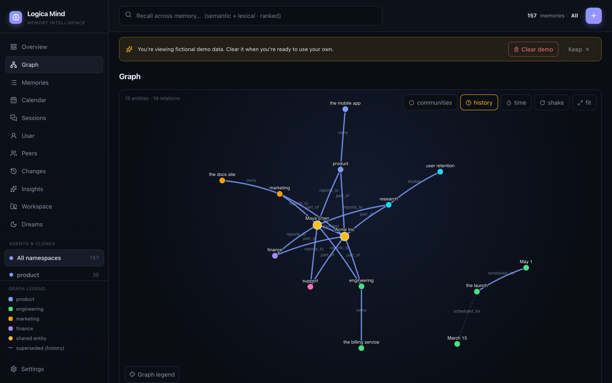
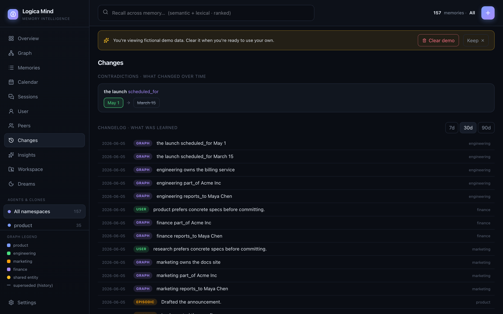
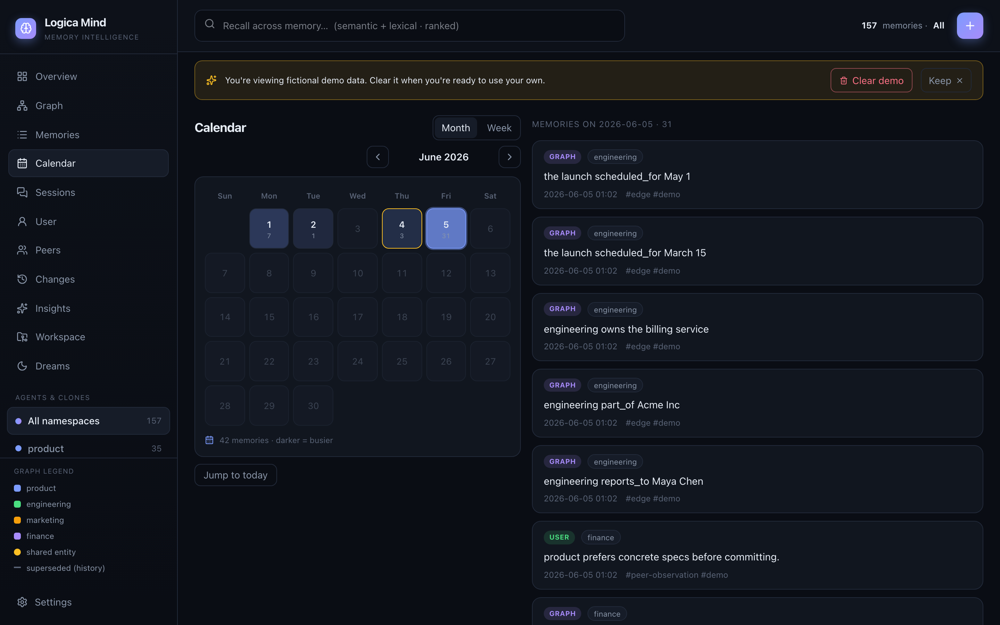
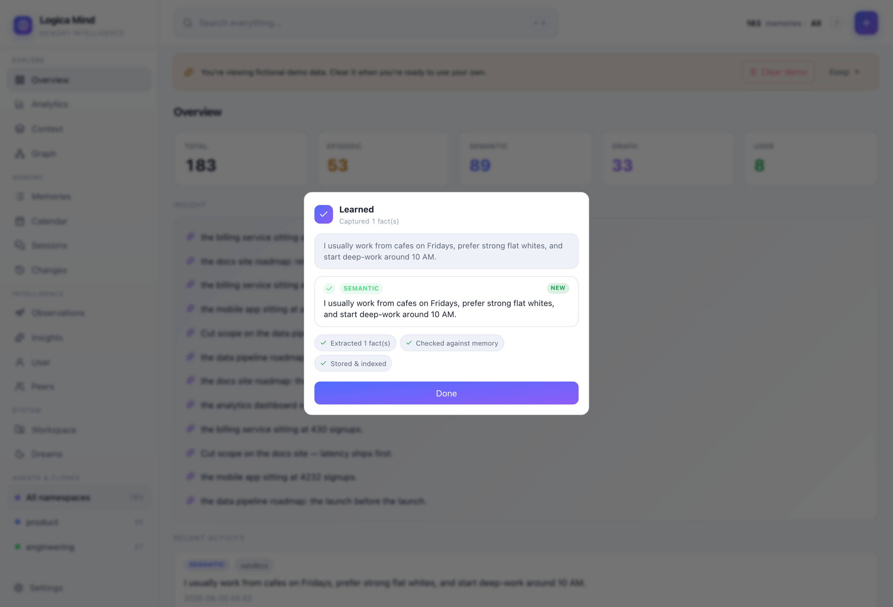

<div align="center">

# 🧠 Logica Mind

### Long-term memory for AI agents — that thinks like a brain, not a database.

**Episodic · Semantic · Temporal Knowledge Graph · Dialectic User Model — in one library.**

[](LICENSE)
[](https://www.python.org/)
[](#%EF%B8%8F-building-from-source)
[](#-model-context-protocol-mcp)
[](CONTRIBUTING.md)

</div>

---

Most memory libraries are a vector store with a nice API: you write a fact, you
search it back. **Logica Mind is different.** It gives your agent four kinds of
memory, a *temporal* knowledge graph that remembers what was true and **when it
changed**, a sleep-time consolidation cycle, and a self-hosted dashboard to watch
it all happen — with **zero required dependencies** and **no API key** to start.

It runs fully offline on the standard library (SQLite + a hashing embedder), then
lights up Voyage / OpenAI / Supabase / Postgres / Redis when you want them.

<div align="center">
  
  <br>
  <em>The built-in dashboard: a live, animated knowledge graph with point-in-time replay, shared-entity detection across agents, and a one-click demo you can clear.</em>
</div>

---

## ⚡ Install

```bash
pip install logica-mind                 # core: zero dependencies, fully offline
pip install "logica-mind[voyage]"       # + Voyage embeddings & reranker
pip install "logica-mind[all]"          # + Voyage, OpenAI, Supabase, Postgres, Redis, local
```

## 🚀 30-second quickstart

```python
from logica_mind import LogicaMind

mind = LogicaMind(namespace="my-app")          # SQLite + offline embedder, no keys

# remember durable facts — extraction, dedup and conflict-resolution are automatic
mind.remember("The user prefers dark mode and concise answers.")
mind.remember("The user is based in Lisbon and works in fintech.")

# recall the most relevant memories (hybrid: semantic vector + lexical, ranked)
for hit in mind.recall("what does the user like?"):
    print(f"{hit.score:.2f}  {hit.memory.content}")

# see it live — open the dashboard
mind.serve()                                    # -> http://127.0.0.1:8420
```

> Prefer the terminal? `logica-mind demo` loads a fictional dataset so you can
> explore every feature instantly, and `logica-mind demo --clear` removes it.

---

## ⭐ What no other memory library does

This is the heart of Logica Mind. Everything below is **shipped and tested**.

### 🕰️ It's a time machine, not a log

Memory isn't just *what* you know — it's *when it became true and when it changed.*

```python
mind.graph.edges(at="2026-01-01")     # replay the ENTIRE knowledge state at a past instant
mind.state_at("2026-01-01")           # "what did the agent know when it made that decision?"
mind.contradictions()                  # every belief that changed value — and exactly when
mind.diff(since, until)                # a memory changelog: "what did this agent learn this week?"
```

- **Point-in-time replay** — reconstruct the full graph (or the whole mind) at any past date. Audit and debug agent behavior after the fact.
- **Temporal contradictions** — a new fact *closes* the old one instead of deleting it; the timeline stays queryable.
- **Memory changelog** — a first-class diff over what was learned in any window. Flat vector stores can't give you this.

### 🧬 A memory that behaves like a brain

```python
mind.forget_curve(days_halflife=30)    # Ebbinghaus decay: unused beliefs fade, recall reinforces
mind.dream(infer_links=True)           # sleep-time cycle: consolidate, reinforce, forget, INFER
mind.stale_beliefs()                   # epistemic self-doubt: "I'm not sure about this anymore"
```

- **Ebbinghaus forgetting curve** — beliefs decay exponentially if never recalled; recalling one resets its clock. The only memory layer where knowledge actually *ages*.
- **Inductive dreaming** — beyond consolidate/prune, the dream cycle **generates new inferred facts** (A→B, B→C ⟹ A relates to C) while idle. It doesn't just store; it reasons.
- **Epistemic self-doubt** — surfaces old, never-recalled, low-confidence beliefs the agent should re-verify. No other memory system exposes its own uncertainty.
- **Contested beliefs & surprise score** — when a new high-confidence belief overturns an old one, both are surfaced as *contested* and scored by how much the worldview shifted.
- **Dream journal** — every consolidation cycle is recorded (distilled / reinforced / forgotten / inferred) so you can *watch the memory think over time*.

### 🤝 Multi-agent native

```python
mind.for_namespace("agent-a")          # one store, N agents/clones, each its own namespace
mind.knowledge_gap("agent-b")          # "what does B know that A doesn't?" — directional
mind.transfer_to("agent-b", fact_id)   # move a fact between agents, with provenance
mind.observe_peer("a", "b", "...")     # directional theory-of-mind: what A believes about B
```

- **One brain, every agent** — a single store serves any number of agents/clones, with an aggregate graph that **detects entities shared across agents** (the gold nodes in the screenshot).
- **Structured run records** — `record_session(...)` captures a whole multi-agent run (participants, roles, contributions, metrics, links) as rich, queryable memory — framework-agnostic, maps onto CrewAI / LangGraph / AutoGen or your own loop.
- **Multi-perspective peers** — model what one participant knows about another, directionally, not merged.

### 🔒 Trust, provenance & portability

```python
mind.provenance(fact_id)               # "why do I believe this?" -> the source turns it came from
mind.forget_about("Acme Inc")          # GDPR-native erase across ALL layers + the graph, one call
bundle = mind.export_bundle(secret=k)  # HMAC-signed, portable memory you can move between vendors
```

- **"Why do I believe this?"** — trace any fact back to the exact source turns/documents it was distilled from. Belief explainability a vector can't give you.
- **GDPR-native erase** — `forget_about(entity)` deletes every memory mentioning an entity across all four layers *and* the graph, in one call. Right-to-be-forgotten as a primitive.
- **Portable, signed memory** — export an HMAC-signed bundle and carry your memory between apps and vendors. Tamper-evident, provider-independent. *Your memory follows you.*
- **Source attribution** — every captured memory is tagged with the client that produced it (Claude Code / Cursor / ChatGPT …), read from the MCP handshake.
- **PII redaction** — `redact_pii()` masks emails, phone numbers and long digit runs from recall output in shared contexts.

### 🖥️ Built to be lived in

- **A live, animated graph explorer** — Obsidian-style canvas physics, community coloring, confidence-weighted edges, entity drill-down, and a **time-scrubber** that replays the graph at any date. Served by the standard library — no Node required for end users.
- **Obsidian-style note pane** — click any memory to open it as a document with a Properties panel and its provenance; entities are first-class (alias resolution collapses *"OpenAI" = "Open AI"*).
- **Context survives compaction** — a `PreCompact` hook distills the conversation into durable memory *right before the host truncates the window*, then brings the relevant slice back on the next session. The fix for "it compacted and we lost everything."
- **Sessions that follow you across machines** — sessions auto-name from their first message, can be renamed and exported, and import directly from your local assistant history. Take your session index anywhere.
- **Danger-zone controls** — scoped erasure from the dashboard: clear by layer, clear stale (old & untouched), or reset a namespace — all behind a typed confirmation.
- **A demo you control** — ship empty, load a rich fictional dataset to explore, then clear it with one click (it only removes the demo, never your data).

### 🧰 More than memory — a coding-context server too

The *same package* is also a Logica-Context-class devtools server: a sandboxed
code `execute`, **Project DNA** (`scan` any repo for its languages, frameworks
and key files), `git` context, a token `budget` meter, an MCP aggregator, and a
shared team knowledge base. One install is a deep memory brain **and** a coding
assistant's context layer.

---

## 🧱 Core, done right

| | |
|---|---|
| **Four memory layers** | `episodic` (raw turns) · `semantic` (distilled facts) · `graph` (temporal entity/relationship edges) · `user` (an evolving, dialectic model of who the user is) |
| **Hybrid recall** | semantic vector + lexical (BM25), blended with importance and recency, then optionally reranked — degrades gracefully to lexical with no embedder |
| **7 stores** | SQLite (default) · In-memory · Obsidian (markdown vault) · MultiStore (write to many at once) · Supabase (pgvector) · Postgres · Redis |
| **6 embedders** | Hashing (offline default) · Voyage · OpenAI · Local (sentence-transformers) · Batched · Voyage-multimodal |
| **5 rerankers** | MMR (diversity) · Voyage cross-encoder · RRF · node-distance · episode-mention |
| **Extraction** | Automatic ADD / UPDATE / DELETE / NOOP with dedup and conflict resolution |
| **Auto-capture hooks** | `SessionStart` / `UserPromptSubmit` / `Stop` / `PreCompact` — memory that survives context compaction |
| **Adapters & SDKs** | LangChain · LlamaIndex · a [provider adapter](examples/provider_adapter.py) for any host · a [TypeScript SDK](sdk-ts/) |

---

## 🔌 Model Context Protocol (MCP)

Logica Mind is a full MCP server — **27 tools** covering memory, recall, the
temporal graph, peers, dreaming, contested beliefs, the forgetting curve, GDPR
erase and structured session records. Point any MCP client (Claude Code, Cursor,
…) at it and your assistant gets durable, queryable memory:

```bash
logica-mind mcp        # run as an MCP server over stdio
```

```jsonc
// in your MCP client config
{ "mcpServers": { "logica-mind": { "command": "logica-mind", "args": ["mcp"] } } }
```

---

## 📊 The dashboard

```bash
logica-mind ui         # -> http://127.0.0.1:8420
```

A self-hosted, single-page dashboard (zero external services) with **11 views**:
Overview · Graph · Memories · Calendar (activity heatmap) · Sessions · User model ·
Peers · Changes (contradictions + changelog) · Insights · Workspace (codebase DNA) ·
Dreams (forgetting curve, contested beliefs, dream journal). Dark / light themes,
English / Português / Español.

<table>
  <tr>
    <td width="50%"><br><sub><b>Dreams</b> — the Ebbinghaus forgetting curve, contested beliefs and a journal of every consolidation cycle.</sub></td>
    <td width="50%"><br><sub><b>Changes</b> — what changed over time: contradictions and a first-class memory changelog.</sub></td>
  </tr>
  <tr>
    <td width="50%"><br><sub><b>Calendar</b> — an Obsidian-style heatmap of memory activity, day by day.</sub></td>
    <td width="50%"><br><sub><b>Overview</b> — per-layer counts, recent activity and synthesized insights.</sub></td>
  </tr>
</table>

---

## 📚 Documentation

Full guides live in [`docs/`](docs/):

| | | |
|---|---|---|
| [Installation](docs/installation.md) | [Quickstart](docs/quickstart.md) | [Core concepts](docs/concepts.md) |
| [Stores](docs/stores.md) | [Embeddings & reranking](docs/embeddings-and-reranking.md) | [Knowledge graph](docs/knowledge-graph.md) |
| [Dreaming & lifecycle](docs/dreaming.md) | [User model & peers](docs/user-model-and-peers.md) | [Sessions & run records](docs/sessions-and-records.md) |
| [MCP server](docs/mcp.md) | [Auto-capture hooks](docs/hooks.md) | [Integrations & SDKs](docs/integrations.md) |
| [Dashboard](docs/dashboard.md) | [Portability & privacy](docs/portability-and-privacy.md) | [CLI](docs/cli.md) |
| [API reference](docs/api-reference.md) | | |

---

## 🛠️ Building from source

```bash
git clone https://github.com/Rovemark/logica-mind.git
cd logica-mind
pip install -e ".[dev]" && pytest -q          # 180 tests, fully offline

# rebuild the dashboard (only if you change the UI)
cd logica_mind/web/app && npm ci && npm run build
```

See [CONTRIBUTING.md](CONTRIBUTING.md) for the full guide.

---

## 📦 Status

**v0.1.0 — Beta.** The full feature set above is shipped and covered by 180 tests.
Episodic, semantic, temporal-graph and dialectic user memory; automatic
extraction; embeddings + reranking; a temporal knowledge graph; sleep-time
consolidation; an MCP server and a self-hosted dashboard — one cohesive library,
offline by default.

## 📄 License

[Apache License 2.0](LICENSE) © Rovemark.
