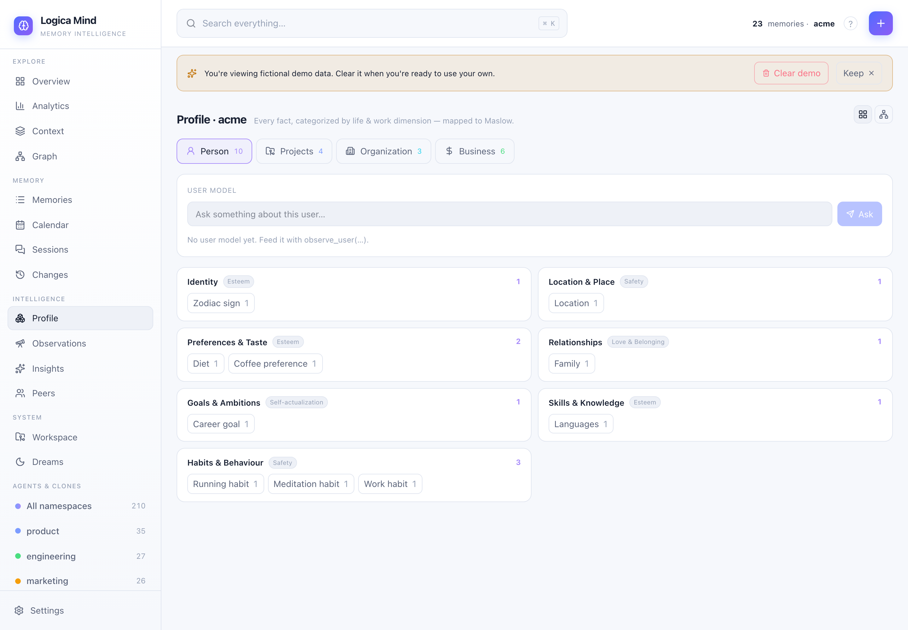
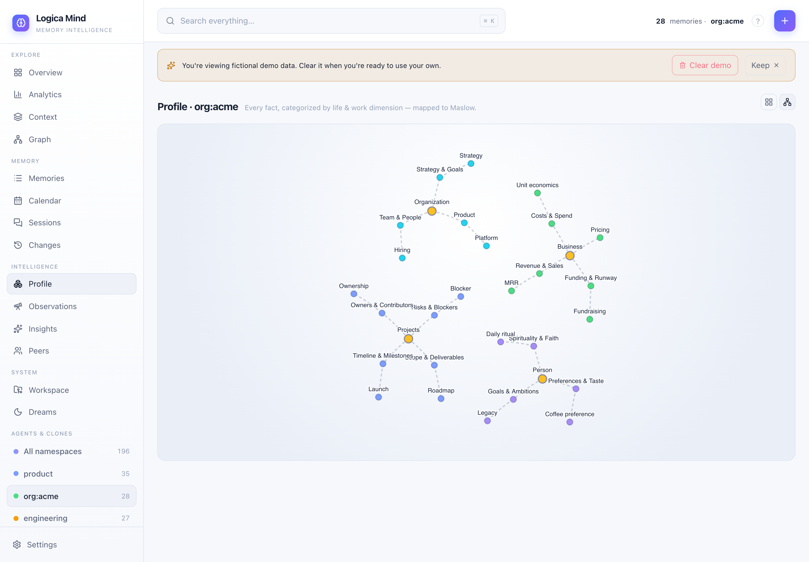

# Fact categorization

Every durable fact in Logica Mind carries two labels that transform raw information into structured understanding:

1. **Category** — an open-vocabulary label the LLM coins on the fly ("Coffee preference", "Zodiac sign", "MRR target", "Launch blocker", etc.)
2. **Dimension** — one of 34 fixed life/work dimensions, each belonging to a fixed GROUP and (for personal dimensions) mapped to Maslow's hierarchy of needs.

Together, they turn a flat pile of facts into a structured portrait of both a person and the work they do.

## The four groups and their dimensions

Logica Mind organizes dimensions into four groups:

### Personal (16 dimensions)

These map directly to **Maslow's hierarchy of needs**, capturing the full spectrum of human well-being.

| Dimension | Maslow Tier | Examples |
|-----------|-------------|----------|
| **Identity** | Esteem | name, age, gender, nationality, ethnicity, languages, zodiac sign, personality type |
| **Location & Place** | Safety | home city, country, current location, hometown, neighbourhood, timezone |
| **Time & Schedule** | Safety | daily routine, working hours, birthday, anniversary, availability, year, season |
| **Preferences & Taste** | Esteem | food, drink, music, brand, style, colour, like, dislike |
| **Relationships** | Belonging | family, partner, friend, colleague, pet, community, mentor |
| **Health & Body** | Physiological | fitness, diet, sleep, medical condition, allergy, energy, sex |
| **Goals & Ambitions** | Self-actualization | personal goal, long-term dream, aspiration, bucket-list item, legacy |
| **Spirituality & Faith** | Self-actualization | religion, faith, spiritual practice, core value, philosophy, ritual |
| **Emotion & State** | Belonging | mood, feeling, stress, joy, fear, motivation |
| **Interests & Hobbies** | Self-actualization | hobby, passion, sport, game, art, travel, fandom |
| **Beliefs & Opinions** | Esteem | worldview, opinion, political view, stance, principle |
| **Skills & Knowledge** | Esteem | expertise, talent, language skill, certification, craft |
| **Habits & Behaviour** | Safety | routine, ritual, vice, tendency, pattern |
| **Possessions** | Safety | device, vehicle, property, tool, wardrobe |
| **Career** | Esteem | job title, employer, profession, career stage, personal role |
| **Personal Finance** | Safety | salary, personal budget, saving, personal investment, debt |

The Maslow tiers form a pyramid from foundational needs to higher aspirations: **physiological** (survival) → **safety** → **belonging** → **esteem** → **self-actualization** (fulfillment).

### Projects (6 dimensions)

For work tasks and initiatives.

- **Project Status**: status, phase, health, progress, completion
- **Scope & Deliverables**: scope, requirement, feature, deliverable, spec
- **Timeline & Milestones**: milestone, deadline, launch date, sprint, schedule
- **Risks & Blockers**: risk, blocker, issue, dependency, bug
- **Owners & Contributors**: owner, contributor, assignee, reviewer, responsibility
- **Decisions**: decision, trade-off, choice, rationale, approval

### Organization (6 dimensions)

For company-wide strategy and operations.

- **Team & People**: team, hire, headcount, role, org structure, culture
- **Product**: product, feature, roadmap, release, positioning
- **Market & Competition**: market, competitor, segment, trend, differentiation
- **Strategy & Goals**: strategy, OKR, objective, vision, mission, priority
- **Customers**: customer, account, churn, feedback, support, segment
- **Partners & Vendors**: partner, vendor, supplier, integration, contract

### Business & Finance (6 dimensions)

For revenue, costs, funding, and metrics.

- **Revenue & Sales**: revenue, MRR, ARR, sales, deal, pipeline
- **Costs & Spend**: cost, expense, burn rate, COGS, overhead
- **Funding & Runway**: funding, investment, runway, valuation, round, cap table
- **Pricing**: price, plan, tier, discount, unit economics
- **Metrics & KPIs**: KPI, metric, growth rate, conversion, retention, CAC, LTV
- **Legal & Compliance**: contract, policy, compliance, regulation, IP, license

## How categorization works

When you feed text into Logica Mind (via `remember()`, `/api/remember`, `lm_remember`, or the dashboard's "Add memory" button), the system:

1. **Extracts facts** — the LLM breaks the text into atomic, durable facts (via `LLMExtractor`)
2. **Coins a category** — for each fact, it invents a short topical label ("Coffee preference", "Seed round status")
3. **Assigns a dimension** — it picks the single best dimension ID from the 34-dimension list
4. **Carries metadata forward** — both category and dimension travel with every memory, queryable everywhere

Categories are open-vocabulary — the model creates new ones as needed. Dimensions are closed (the fixed 34 above), so the system can aggregate them reliably (e.g., "show me all facts in the Personal group" or "what am I storing under Esteem?").

## How it powers the system

Categorization shows up in five places:

- **Profile view** (`/api/dimensions` endpoint, `mind.dimensions()`) — visualizes every fact grouped by dimension and Maslow tier, with open categories underneath. The dashboard shows this as a colorful tree under the Profile tab.
- **lm_dimensions** MCP tool — query what's been learned about a user or company by dimension (e.g., "what personal goals are stored?").
- **lm_recall / lm_remember** — filter searches by dimension or category.
- **Dashboard analytics** — the learning animation shows which dimensions facts are flowing into.
- **⌘K global search** — the Spotlight palette includes a "categories" section so you can jump to a fact by its category label.

Internally, it also powers:

- `/api/dimensions` — returns the full dimension profile with category distribution
- `/api/memories?dimension=` — scope memory lists to one dimension
- `/api/memories?category=` — exact-category filter
- `mind.recall(category="MRR")` — filter recall by category in Python

## Worked example

Say you send Logica Mind this message:

> I love a good flat white and I'm a Scorpio. We just hit 12k MRR. The new API is blocked on the database migration — my team can't ship until that's done.

The LLM extracts **four separate facts** across **four different dimensions**:

1. **"Loves flat white"** → Category: "Coffee preference", Dimension: **preference** (Personal / Esteem)
2. **"Scorpio"** → Category: "Zodiac sign", Dimension: **identity** (Personal / Esteem)
3. **"MRR is 12k"** → Category: "Monthly recurring revenue", Dimension: **biz_revenue** (Business & Finance)
4. **"API launch blocked on database migration"** → Category: "Launch blocker", Dimension: **project_risk** (Projects)

The Profile view then shows:
- Under Personal → Esteem: two facts ("Coffee preference", "Zodiac sign")
- Under Business & Finance → Revenue & Sales: one fact ("Monthly recurring revenue")
- Under Projects → Risks & Blockers: one fact ("Launch blocker")

Each category bubbles up as you explore, so you can click "Coffee preference" to see all memories tagged with that label, or filter `/api/memories?category=Coffee%20preference` to retrieve them.

## Requirements

Categorization requires **an LLM**. Logica Mind works fully offline without one — it stores facts just fine — but automatic category + dimension assignment only happens when:

- An LLM is available (Claude, OpenAI, Anthropic)
- The `LLMExtractor` is active (automatic if an LLM is detected, or explicit via `extractor=LLMExtractor(llm)`)

The system **works with the local Claude CLI** (zero API keys needed):

```python
from logica_mind import LogicaMind
from logica_mind.llm.claude_cli import ClaudeCLILLM

mind = LogicaMind(llm=ClaudeCLILLM())
mind.remember("I love coffee and I work in fintech")
```

Without an LLM, `NoopExtractor` runs instead — it stores the raw text as a single fact with no category or dimension. Facts extracted by the LLM will still show categorization system-wide.

## API reference

### Read categorization

**Python:**
```python
profile = mind.dimensions()
# Returns:
# {
#   "dimensions": [
#     {"id": "identity", "label": "Identity", "group": "personal", 
#      "maslow": "esteem", "count": 5,
#      "categories": [{"name": "Zodiac sign", "count": 1}, ...]},
#     ...
#   ],
#   "uncategorized": 3,
#   "maslow": ["physiological", "safety", "belonging", "esteem", "self-actualization"]
# }
```

**HTTP:**
```
GET /api/dimensions?namespace=default
```

### Filter by dimension or category

**Python:**
```python
results = mind.recall("coffee", category="Coffee preference")
results = mind.recall("projects", limit=20)  # no filter — all dimensions
```

**HTTP:**
```
GET /api/memories?dimension=preference
GET /api/memories?category=Coffee%20preference
GET /api/recall?q=coffee&category=Coffee%20preference
```

### MCP tools

The `lm_dimensions` tool (in Claude Code) lists the full dimension profile for a namespace:

```
lm_dimensions --namespace alice
```

Returns the categorization tree — all facts grouped by dimension, Maslow tier, and open category.

## Dashboard



The Profile view renders the full dimension tree. Each dimension card shows:
- The Maslow tier (for personal dimensions only)
- Count of facts in that dimension
- The open categories underneath, with counts

Click any category to filter the memory list to that label; click a dimension to scope the search to it.

It has two modes:
- **Cards** — the dimension tree above, tabbed by Person / Projects / Organization / Business (the Person tab also holds the dialectic user model + an ask box).
- **Knowledge map** — the same data as a clickable graph (group → dimension → category). Click a node to jump straight to its filtered memories.



### Categorization in the knowledge graph

The four groups carry a colour language — **Person** (purple), **Projects** (blue), **Organization** (cyan), **Business** (green) — and it extends to the entity graph. Toggle **life areas** on the Graph view to paint every entity by its dominant dimension (bridged from the categorized facts that mention it), then use the area chips to filter the graph down to one area. See [Knowledge graph](./knowledge-graph.md).

## See also

- [Connections](./connections.md) — Derived backlinks built on top of categorization + the graph
- [Concepts](./concepts.md) — Core abstractions: layers, memories, extraction
- [Memory extraction](./memory-extraction.md) — How facts are decomposed from text
- [MCP tools](./mcp.md) — lm_remember, lm_recall, lm_dimensions, and friends
- [Dashboard](./dashboard.md) — The full UI tour
