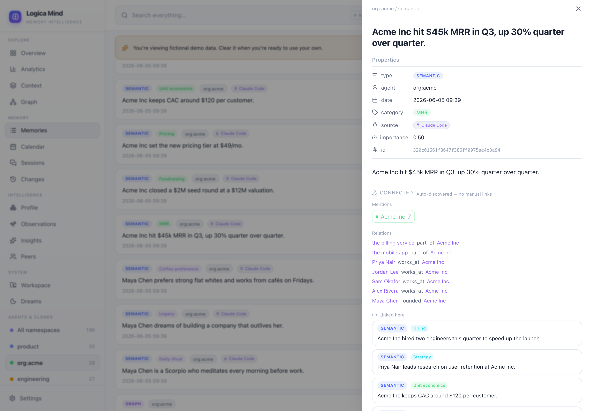

# Connections — backlinks that write themselves

In Obsidian, links are something you *author*: you type `[[Acme Corp]]` by hand, and a note is only as connected as you remembered to make it. Logica Mind inverts that. Because it already has a temporal knowledge graph and categorized facts, the connective tissue between memories can be **derived** — no manual links to type or maintain.

`mind.connections(memory_id)` returns everything related to a single memory, inferred from what's already stored:

```python
conn = mind.connections(fact_id)
conn["entities"]    # graph entities this memory mentions (typed, life-area coloured)
conn["relations"]   # the typed relations touching those entities
conn["mentions"]    # OTHER memories that mention the same entities  ← the auto-backlink
conn["siblings"]    # facts that share this memory's category or dimension
```

## How each link is derived

| Field | Derived from | Answers |
|---|---|---|
| `entities` | graph entity names that appear in the memory's content (word-boundary match); for a graph edge, its subject/object directly | "what is this memory *about*?" |
| `relations` | every valid/closed edge whose subject or object is one of those entities | "how do those things relate?" |
| `mentions` | other memories whose content names any of the same entities | "what else talks about these?" — the backlink |
| `siblings` | memories sharing this memory's `category` or `dimension` | "what's of the same kind?" |

Each entity carries its **dominant life-area dimension**, so the dashboard can colour it the same way the [Profile](./categorization.md) and the [knowledge graph](./knowledge-graph.md) do.

Nothing here is hand-authored. Add a fact that happens to mention an entity another fact already mentions, and the two are linked the instant they're stored.

## In the dashboard



Open any memory (click a card) and the note pane shows a **Connected** panel beneath the content:

- **Mentions** — entity chips, coloured by life-area; click one to open it in the graph.
- **Relations** — the typed edges (closed edges are struck through).
- **Linked here** — other notes that mention the same entities. Click to **walk** to that note (there's a back stack, so you can traverse note-to-note like a wiki and step back out).
- **Related** — siblings by category/dimension.

`[[wikilinks]]` written into a memory's content are still rendered and clickable — they open the named entity in the graph. So you get the manual affordance *and* the automatic one.

## Over MCP

The same data is one tool call away in Claude Code, Cursor or any MCP host:

```
lm_connected --id <memory_id>
```

Returns the `{entities, relations, mentions, siblings}` payload above — so an agent can traverse its own memory's neighborhood without a vector search.

## Over HTTP

```
GET /api/connected?namespace=<ns>&id=<memory_id>
```

## See also

- [Knowledge graph](./knowledge-graph.md) — the temporal graph the entities and relations come from
- [Fact categorization](./categorization.md) — the dimensions that colour entities and group siblings
- [MCP tools](./mcp.md) — `lm_connected`, `lm_dimensions`, and the rest
- [Dashboard](./dashboard.md) — the full UI tour
