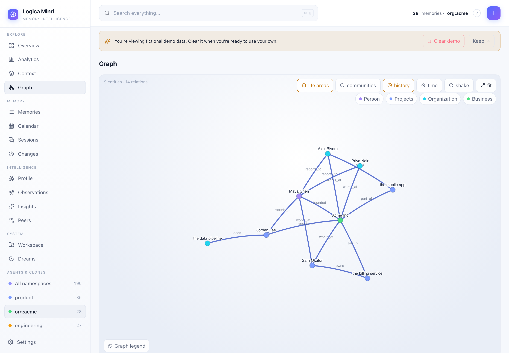
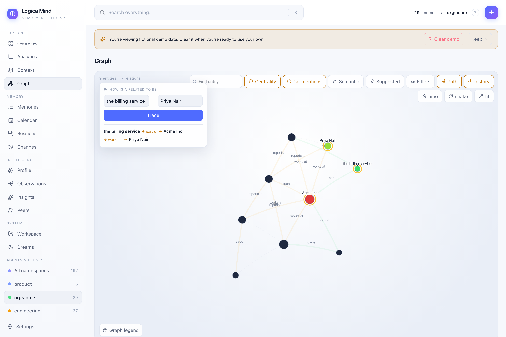

# Temporal Knowledge Graph

A bitemporal knowledge graph that stores facts as edges, closes old facts when they change instead of deleting them, and lets you ask "what is true now?" and "what was true on date X?".

Most memory stores are flat lists of text. Logica Mind also keeps a **temporal knowledge graph**: a set of `(subject) --predicate--> (object)` edges where each edge carries a validity window. When a new fact contradicts an existing one, the old edge is *closed* (its `valid_to` is set) rather than thrown away, so the full history stays queryable.

The graph lives inside the same `Store` as everything else, so it works fully **offline and zero-key** by default (SQLite store + hashing embedder). Adding edges by hand needs no LLM at all. Only the *automatic* extraction of edges from prose needs an LLM — see [Auto-extraction from text](#auto-extraction-from-text) below.

Everything here is reachable two ways:

- through the high-level `LogicaMind` API (`mind.learn_graph(...)`, `mind.contradictions()`, `mind.entity(...)`, ...), and
- through the graph object directly: `mind.graph` is a `TemporalGraph`.

```python
from logica_mind import LogicaMind

mind = LogicaMind(namespace="research")   # SQLite + hashing embedder, no keys
mind.graph.ingest("Maya", "founded", "Acme Inc")
print(mind.graph.edges())                 # [Edge(Maya founded Acme Inc)]
```

---

## Edges

An edge is a time-bounded relationship. It is defined by `Edge` in `logica_mind.graph`:

```python
from logica_mind.graph import Edge
```

| Field | Type | Meaning |
| --- | --- | --- |
| `subject` | `str` | The entity the fact is about. |
| `predicate` | `str` | The relation, e.g. `founded`, `lives_in`, `focus`. |
| `object` | `str` | The other entity or a value. |
| `fact` | `str` | Optional natural-language statement of the edge. |
| `valid_from` | `str` (ISO) | When the fact became true. Defaults to now. |
| `valid_to` | `str` or `None` | When it stopped being true. `None` means **still valid**. |
| `confidence` | `float` | Fact rating, clamped to `[0, 1]`. |
| `subject_type` | `str` | Optional ontology type, e.g. `"Person"`. |
| `object_type` | `str` | Optional ontology type, e.g. `"Organization"`. |
| `source_ids` | `list[str]` | Provenance: ids of the memories/episodes this fact came from. |
| `id` | `str` | Stable id of the edge. |

Two helpers are worth knowing:

- `edge.is_valid` — `True` when `valid_to is None` (the fact is current).
- `edge.valid_at(ts)` — whether the fact was true at an ISO timestamp `ts`. It compares real UTC instants, so `Z`, offset, and fractional timestamp forms all behave correctly.

---

## Ingesting edges

### Manually with `ingest()`

`TemporalGraph.ingest()` adds one edge:

```python
edge = mind.graph.ingest(
    "Maya", "focus", "Project A",
    confidence=0.9,
    subject_type="Person",
    object_type="Project",
    source_ids=["episode-42"],
)
```

Signature (defaults shown):

```python
mind.graph.ingest(
    subject, predicate, obj,
    fact="",
    single_valued=True,
    ts=None,             # ISO timestamp; defaults to now
    confidence=1.0,
    subject_type="",
    object_type="",
    source_ids=None,
)
```

`ingest()` is **idempotent**: re-ingesting an identical `(subject, predicate, object)` that is still valid is a no-op (it only merges in any new `source_ids`).

### From the high-level API with `build_graph=True`

`mind.remember(...)` normally just stores a memory. Pass `build_graph=True` to *also* extract graph edges from the same text (requires an LLM):

```python
mind.remember("Maya founded Acme Inc in 2020.", build_graph=True)

edges = mind.graph.edges()
# -> contains an edge with subject="Maya", object="Acme Inc"
```

The same `build_graph=True` flag is accepted by `mind.ingest_document(...)` to build graph edges per chunk.

### From free text with `learn_graph()`

`mind.learn_graph(text)` extracts edges from prose and returns the new edges. It needs an LLM; offline it is a safe no-op that returns `[]`.

```python
new_edges = mind.learn_graph("Bob lives in Paris and works at Acme Inc.")
```

Under the hood this calls `mind.graph.ingest_text(text, extractor)`, which you can call directly if you hold your own `GraphExtractor`.

---

## Auto-extraction from text

The class that turns prose into triples is `GraphExtractor` in `logica_mind.graph`:

```python
from logica_mind.graph import GraphExtractor, Triple
```

Each extracted `Triple` has `subject`, `predicate`, `object`, `fact`, `confidence`, `subject_type`, and `object_type`. The extractor asks the LLM for short snake_case predicates and entity categories (`Person` / `Organization` / `Place` / `Product` / `Concept`), and to skip opinions, greetings, and filler.

```python
from logica_mind import LogicaMind
from logica_mind.llm.base import LLM

class MyLLM(LLM):
    name = "my-llm"
    available = True
    def complete(self, prompt, system=None):
        ...  # call your model, return the text

mind = LogicaMind(namespace="research", llm=MyLLM())
mind.learn_graph("Maya founded Acme Inc. Acme is based in Lisbon.")
```

Without an LLM (`available = False`), `GraphExtractor.extract()` returns nothing and the graph simply stays **manual** — `ingest()` still works perfectly.

### Multi-valued vs. single-valued, automatically

`ingest_text()` is batch-aware. When one text yields several objects for the same `(subject, predicate)` slot, those are treated as **multi-valued** and do **not** invalidate each other:

```python
mind.learn_graph("Alice speaks English and Spanish.")
valid = [e for e in mind.graph.edges() if e.predicate == "speaks"]
# both 'English' and 'Spanish' stay valid
```

A genuine update across *separate* texts (e.g. `lives_in Paris`, then later `lives_in Berlin`) still closes the old edge. See the next section for the rule.

---

## Entity nodes & alias resolution

Entity names are folded to a comparison key so casing, spacing, and punctuation variants collapse onto **one node**:

> `"Open AI"`, `"OpenAI"`, and `"open-ai"` all resolve to a single entity.

So `mind.graph.ingest("Open AI", ...)` and `mind.graph.ingest("OpenAI", ...)` land on the same node. The **first-seen spelling** becomes the canonical display name.

### Explicit aliases

When two spellings can't be matched by normalization alone (e.g. a nickname), declare an alias. Explicit aliases win over first-seen resolution:

```python
mind.add_alias("Robert", "Bob")     # 'Robert' is the same entity as 'Bob'
mind.graph.aliases_of("Bob")        # -> ["Robert"]
```

Aliases are persisted, so subsequent ingests resolve through them. This matters: if the graph fragments across two spellings of the same entity, single-valued invalidation silently misses the update. `mind.add_alias(...)` forwards to `mind.graph.add_alias(...)`.

### First-class entity views

```python
mind.graph_nodes()        # every entity with its degree, busiest first
mind.entity("Maya")       # canonical name, type, aliases, edges, neighbours
```

`mind.entity(name)` returns a dict like:

```python
{
    "name": "Maya",
    "type": "Person",
    "aliases": [...],
    "degree": 3,           # number of currently-valid edges
    "degree_total": 5,     # including closed (historical) edges
    "neighbors": ["Acme Inc", "Project A", ...],
    "facts": ["Maya founded Acme Inc", ...],
}
```

Other handy reads on `mind.graph`:

- `mind.graph.neighbors("Maya")` — sorted neighbour names.
- `mind.graph.query("Maya")` — edges touching an entity (alias-aware).
- `mind.graph.resolve("Open AI")` — the canonical display name for a spelling.

---

## Temporal validity & invalidation

Each edge has a validity window `[valid_from, valid_to)`. An edge with `valid_to is None` is currently true.

When `single_valued=True` (the default for `ingest()`), a new edge with the same `(subject, predicate)` but a **different** object *closes* the existing one — it sets the old edge's `valid_to` instead of deleting it. This is a temporal update, not an overwrite:

```python
mind.graph.ingest("Maya", "focus", "Project A")
mind.graph.ingest("Maya", "focus", "Project B")   # supersedes Project A

valid = [e for e in mind.graph.edges() if e.predicate == "focus"]
# -> exactly one valid edge: Maya focus Project B

history = mind.graph.edges(include_history=True)
# -> two edges: Project A (closed) and Project B (valid)
```

Pass `single_valued=False` to allow several objects to coexist for one slot (the multi-valued case, e.g. "speaks English **and** Spanish").

Closing an edge **preserves its stored embedding** — the row is updated in place, not rewritten — so historical edges stay searchable.

---

## Point-in-time queries

Ask what the graph looked like at any instant by passing `at=<ISO timestamp>` to `edges()`:

```python
mind.graph.ingest("Maya", "focus", "Project A", ts="2026-01-01T00:00:00Z")
mind.graph.ingest("Maya", "focus", "Project B", ts="2026-06-01T00:00:00Z")  # closes A

mind.graph.edges(at="2026-03-01T00:00:00Z")   # -> Project A (true in March)
mind.graph.edges(at="2026-07-01T00:00:00Z")   # -> Project B (true in July)
```

`at` returns only edges that were valid at that instant — "what was true on date X". It works across timestamp formats, including non-UTC offsets like `2026-03-01T03:00:00-03:00`.

By default `edges()` returns only currently-valid edges. Pass `include_history=True` to include closed ones. `query(entity, at=...)` and the visualization payload (`to_viz(at=...)`, `mind.graph_viz(at=...)`) accept the same `at` parameter.

---

## Contradictions — the audit trail

`mind.contradictions()` surfaces every fact that **changed over time**: graph slots `(subject, predicate)` that have held more than one object, with the full temporal history.

```python
mind.graph.ingest("Maya", "focus", "Project A", ts="2026-01-01T00:00:00Z")
mind.graph.ingest("Maya", "focus", "Project B", ts="2026-06-01T00:00:00Z")

mind.contradictions()
# [
#   {
#     "subject": "Maya",
#     "predicate": "focus",
#     "history": [
#       {"object": "Project A", "valid_from": "2026-01-01T00:00:00Z",
#        "valid_to": "2026-06-01T00:00:00Z", "current": False},
#       {"object": "Project B", "valid_from": "2026-06-01T00:00:00Z",
#        "valid_to": None, "current": True},
#     ],
#   }
# ]
```

This is the "what did I believe, and when did it change?" history that a flat memory store can't give you.

---

## Communities

`mind.graph_communities()` (or `mind.graph.communities()`) clusters the graph into **connected components** — groups of entities linked by edges, largest first.

```python
mind.graph.ingest("A", "r", "B")
mind.graph.ingest("B", "r", "C")   # A-B-C is one cluster
mind.graph.ingest("X", "r", "Y")   # X-Y is a separate cluster

comms = mind.graph.communities()
# -> two communities, with node counts 3 and 2
```

Each community is a dict `{"nodes": [...], "edges": [Edge, ...]}`. With an LLM available you can also summarize each cluster:

```python
mind.graph_communities(summarize=True)
# -> [{"nodes": [...], "summary": "..."}, ...]
```

Without an LLM, the summary is simply the list of facts in the cluster (no key required, still works offline).

---

## BFS traversal

`mind.graph.bfs(start, depth=2)` does a breadth-first walk from an entity and returns the neighbourhood reachable within `depth` hops:

```python
hood = mind.graph.bfs("Maya", depth=2)
hood["nodes"]    # entities in visit order, starting with "Maya"
hood["edges"]    # the edges traversed
hood["levels"]   # {entity_name_lowercased: hop_distance}
```

Pass `include_history=True` to traverse closed edges as well.

---

## Provenance — `source_ids`

Every edge can carry `source_ids`: the ids of the memories or episodes the fact came from. This lets you trace any edge back to the text that produced it.

```python
mind.graph.ingest("Maya", "founded", "Acme Inc", source_ids=["doc-1#chunk-3"])
```

`source_ids` are **merged**, not replaced, when you re-ingest the same fact. Ingesting the identical `(subject, predicate, object)` again with a new source id simply appends it to the existing provenance list, so an edge accumulates every place it was asserted:

```python
mind.graph.ingest("Maya", "founded", "Acme Inc", source_ids=["doc-1"])
mind.graph.ingest("Maya", "founded", "Acme Inc", source_ids=["doc-2"])
# the edge now lists both "doc-1" and "doc-2" in source_ids
```

When edges are built from prose via `learn_graph()` / `ingest_text()`, you can pass a `source_ids` list to stamp every extracted edge with the same provenance.

---

## Visualizing the graph

For a live, browsable view of the graph — entities, edges, validity windows and confidence — launch the dashboard:

```bash
python -m logica_mind ui
```

Programmatically, `mind.graph_viz(namespace=..., at=...)` returns the `{nodes, links}` payload the dashboard renders, including a *general* graph across all namespaces with shared entities flagged.

### Colour by life-area

Each node in the `graph_viz` payload also carries a `dimension` field when one can be inferred — the **dominant life/work dimension** of the entity, bridged from the [categorized facts](./categorization.md) that mention it. In the dashboard, toggle **life areas** to paint every entity by its group (Person / Projects / Organization / Business) and use the area chips to filter the graph down to a single area. Entities with no categorized facts stay neutral.



### Walking connections

Any entity (and any memory) exposes its neighborhood through [`mind.connections(id)`](./connections.md) — the relations touching it, the other memories that mention it, and siblings of the same category. It's the derived-backlink layer the dashboard's **Connected** panel renders.

## Graph intelligence

The graph doesn't just draw — it reasons about its own structure. Each of these is pure-Python over the temporal graph (no LLM), exposed in the dashboard, the REST API and as an MCP tool.

### Connection layers

`graph_viz(layers=[…])` returns more than explicit relations. Every link carries a `kind`:

- **relation** — an explicit typed edge (always on), `directed`, `weight` = confidence, plus a `pclass` (predicate class: social / has / causal / locative / temporal / is_a) the canvas hues it by.
- **co_mention** — an *emergent* link between two entities a single memory names together, with no explicit edge. One regex scan, capped per memory. The computed version of Obsidian's "unlinked mention".
- **semantic** — *opt-in*. Entity pairs whose memory-neighbourhoods are close in vector space but unlinked. Built from stored embeddings only (never embeds in the request path), capped to the busiest entities. Meaningful with a real embedder.

Every node also carries a **`centrality`** (normalized PageRank) for sizing, a **`degree`**, and a **`bridge`** flag (see below).

### How is A related to B?

```python
mind.how_related("the billing service", "Priya Nair")
# → the billing service --part_of--> Acme Inc --works_at--> Priya Nair
```

A confidence-weighted shortest path (Dijkstra, cost = 1/confidence) returned as an ordered chain of **typed** hops. The dashboard's **Path** mode traces it and spotlights it on the canvas — path nodes gold-ringed, path edges gold, everything else dimmed. The question a graph of hand-authored, untyped links can't answer. MCP: `lm_how_related`.



### Bridges

```python
mind.bridges()    # entities whose removal fragments the graph (articulation points)
```

The load-bearing connectors that broker between otherwise-separate clusters — often low-degree nodes that centrality ranking misses. Flagged on nodes (`bridge: true`) and ringed on the canvas. MCP: `lm_bridges`.

### Suggested links (predict the missing edge)

```python
mind.suggested_links()   # pairs with a strong shared neighbourhood but no edge
```

Link prediction by Adamic-Adar: entity pairs with no direct relation but many common neighbours — "these two probably relate, you just never said so". A **Suggested** layer overlays them as dashed candidate edges. The biggest "nobody has this" moment — note tools make you author every link. MCP: `lm_suggested_links`.

### Local graph, hover & filters

The dashboard adds a **local/ego graph** (focus an entity → collapse to its neighbourhood, with a 1–3 hop depth slider), **hover previews** (a node's top facts without a click), search-to-focus, a min-confidence declutter slider, per-predicate-class filters, and **colour-by** (namespace / community / life-area / centrality) plus a highlight-by-query colour group.

---

## See also

- [Connections](./connections.md) — derived backlinks built on the graph + categorization.
- [Fact categorization](./categorization.md) — the dimensions that colour graph nodes.
- [Quickstart](./quickstart.md) — the 30-second, zero-key tour.
- [Installation](./installation.md) — install and optional extras.
- [Concepts](./concepts.md) — memory layers, the temporal model, and how graph edges fit in.
- [Stores](./stores.md) — where edges are persisted (SQLite by default, zero-key).
- [Embeddings & reranking](./embeddings-and-reranking.md) — edges are embeddable and searchable like any memory.
- [User model & peers](./user-model-and-peers.md) — per-namespace user models alongside the graph.
- [Dreaming](./dreaming.md) — inductive consolidation that connects existing graph facts into new ones.
