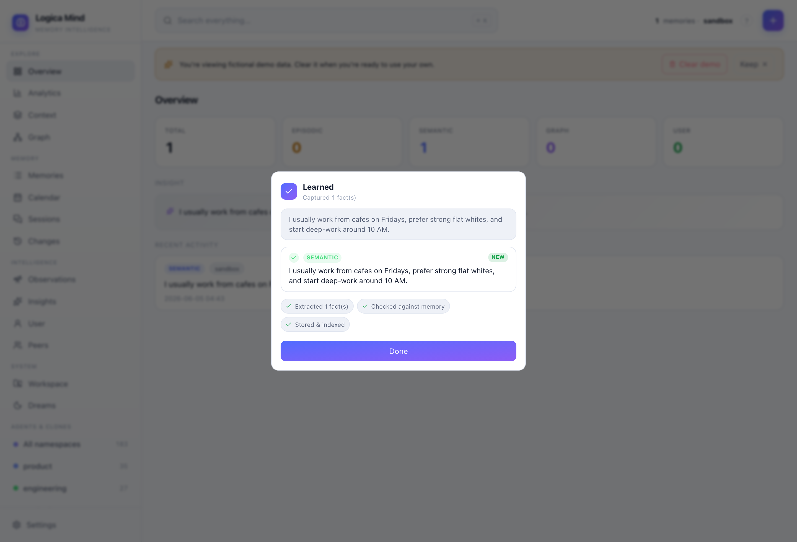

# How memory is learned

Logica Mind is not a key-value store you write to. You hand it raw text and it
**learns** — it pulls out the durable facts, reconciles each one against what it
already knows, and only then persists. This page explains exactly what happens
between `mind.remember("…")` and a row in the store, and how the dashboard shows
it to you live.

- [The pipeline](#the-pipeline)
- [Extraction: one message → many facts](#extraction-one-message--many-facts)
- [Reconciliation: add, update, delete, no-op](#reconciliation-add-update-delete-no-op)
- [Watching it learn in the dashboard](#watching-it-learn-in-the-dashboard)
- [Zero-config vs. with an LLM](#zero-config-vs-with-an-llm)
- [The API](#the-api)

---

## The pipeline

Every write runs the same path:

```
text ──▶ extract ──▶ embed ──▶ reconcile vs. existing ──▶ persist ──▶ (optional) link graph
          │            │           │                          │              │
          │            │           │                          │              └─ entity/relation triples
          │            │           │                          └─ new row, or update-in-place + supersede
          │            │           └─ semantic search for near-duplicates / prior beliefs
          │            └─ one batched embedding call for all extracted facts
          └─ split into atomic, durable facts (LLM) or keep as one (offline)
```

Nothing here is bookkeeping you have to do. `remember()` does extraction, dedup
and conflict-resolution by default.

---

## Extraction: one message → many facts

A single human sentence usually carries several durable facts. Give Logica Mind:

> "I usually work from cafés on Fridays, prefer strong flat whites, and start
> deep-work around 10 AM."

With an LLM configured, the extractor decomposes it into **atomic** facts, each
independently storable, recallable and updatable:

| Extracted fact | Layer |
| --- | --- |
| Works from cafés on Fridays | semantic |
| Prefers strong flat whites | semantic |
| Starts deep-work around 10 AM | semantic |

Atomicity matters: if next week the coffee order changes, only that one fact is
updated — the café habit and the working hour are untouched.

---

## Reconciliation: add, update, delete, no-op

Each extracted fact is embedded and compared against the most similar existing
memories in the same namespace. The extractor then decides one of four operations:

| Op | When | Effect |
| --- | --- | --- |
| **add** | genuinely new information | a new memory is created (tagged **new**) |
| **update** | a known fact changed value | the new value is stored and the prior belief is **superseded** (tagged **updated**, the old value kept as history) |
| **delete** | a known fact is now false | the stale memory is removed, nothing created |
| **no-op** | the fact is already known | nothing stored — the existing memory stands (deduped) |

This is the difference between **storing** and **learning**: Logica Mind does not
accumulate five drifting copies of the same fact. It keeps the current truth, and
— because an update *supersedes* rather than deletes — the trail of what it used
to believe stays queryable (see [Changes](dashboard.md#changes) and the
[temporal knowledge graph](knowledge-graph.md)).

Even with **no LLM**, reconciliation still runs: the text is captured as one
durable memory and near-duplicates are suppressed by embedding similarity, so you
never get two identical rows.

---

## Watching it learn in the dashboard

Add a memory from the dashboard (the **+** in the top bar) and the modal animates
exactly what the engine learned, instead of silently closing:



- the message you sent, as a bubble;
- each extracted fact revealed one at a time (a live "memory n/n" counter),
  tagged **new** or **updated** — an update strikes through the belief it replaced;
- the pipeline stages ticking off: **extracted → checked against memory → stored**,
  plus **linked _n_ relations** when graph extraction ran and **user model updated**
  for an observation;
- a **no-op** reads as *"already known — reinforced, nothing duplicated."*

Nothing in that animation is decoration: every line reflects a real operation the
engine performed on your store.

---

## Zero-config vs. with an LLM

| | Zero-config (default) | With an LLM |
| --- | --- | --- |
| Decompose a message into multiple facts | no — captured as one memory | **yes** |
| Update-in-place + supersede prior beliefs | — | **yes** |
| Delete facts that became false | — | **yes** |
| Dedup near-duplicates | **yes** (embedding similarity) | yes |
| Extract entity/relation graph triples | — | **yes** (`build_graph=True`) |
| API keys required | none | one provider key |

Logica Mind **auto-detects** a provider already present in your environment (e.g.
`OPENAI_API_KEY`). When one is found, extraction, conflict-resolution and graph
linking turn on automatically — no code change. With nothing configured it runs
fully offline and still dedups. See [Embeddings & reranking](embeddings-and-reranking.md)
and the Integrations panel in the dashboard for the active stack.

---

## The API

```python
from logica_mind import LogicaMind

mind = LogicaMind(namespace="my-app")

# the everyday path: extract + dedup + reconcile, all automatic
created = mind.remember("The user moved from Lisbon to Porto and now prefers tea over coffee.")
for m in created:
    print(m.layer, m.content)          # the facts that were actually learned

# also pull entity/relation triples into the temporal graph (needs an LLM)
mind.remember("Maya founded Acme and reports to the board.", build_graph=True)

# ingest a whole conversation — every turn logged, durable facts extracted from
# the full exchange, user observations derived
mind.ingest_conversation([
    {"role": "user", "content": "I just switched to a standing desk."},
    {"role": "assistant", "content": "Nice — how's your back?"},
    {"role": "user", "content": "Much better, I stand most of the morning now."},
])
```

`remember()` returns the list of memories it actually created — so you can see, in
code, what was learned vs. deduped. The dashboard's **Add** flow calls the same
path through `POST /api/add`, which returns the structured result the animation
renders.

---

### See also

- [Concepts](concepts.md) — the four memory layers and how they relate
- [Knowledge graph](knowledge-graph.md) — entity/relation extraction and the time machine
- [Dashboard](dashboard.md) — the Context block, Changes and the rest of the UI
- [Embeddings & reranking](embeddings-and-reranking.md) — providers and auto-detection
